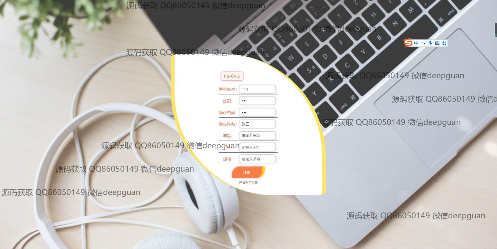
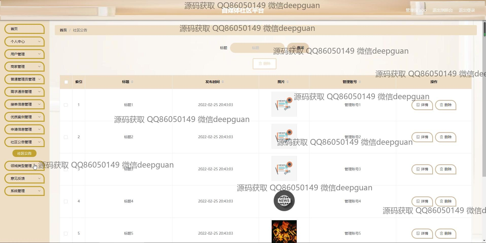

<h1 align="center">自媒体社区平台</h1>

## 简介
Springboot731自媒体社区平台：角色分为管理员、用户；功能包括需求通告管理、用户注册与信息管理、订单信息管理、案例展示及评论功能、意见反馈、后台审核和社区公告管理。    --计算机毕业设计源码；毕设源码；java毕业设计源码

## 联系方式

<h3 align="center">获取完整代码与数据库文件 + 微信：deepguan QQ: 86050149 QQ群: 783742310</h3>

<h3 align="center">可帮忙远程部署 包运行成功！提供远程部署、修改代码、设计文档指导、代码讲解等服务！</h3>

## 功能介绍（完整见运行截图）
管理员：管理后台功能包括需求者管理、优质博主管理、申请信息管理、社区公告管理等，可以查看、修改、删除订单和用户信息，并进行审核操作。同时，管理员可以管理用户账户，查看反馈和删除不良信息，加强平台安全性和实用性。

用户：用户可以通过注册界面创建账户，使用个人中心查看和更新个人信息。平台首页提供需求通告、优质案例等模块，用户可以浏览、收藏案例或参与投票。订单详情页允许用户查看订单要求，接受任务，进行内容管理与交互。

商家：商家注册界面支持注册和管理商家账户，填写必要的联系信息。商家可以通过接单信息管理页面查看订单状态、商家编号和备注信息，以便有效跟踪和管理任务，支持商家和用户间的互动交流。

博主：博主可以在平台上注册和管理自己的账户，通过发布优质内容和需求通告提升影响力。个人信息页面允许博主更新资料并上传图片，籍此不断与社区互动，提高内容曝光率和个人影响力。

## 运行截图

本代码来源于网络,仅供学习参考使用!

